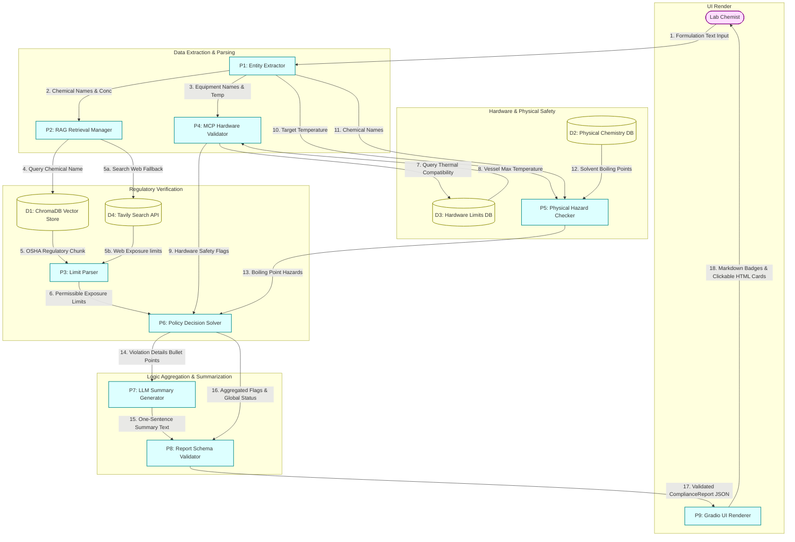
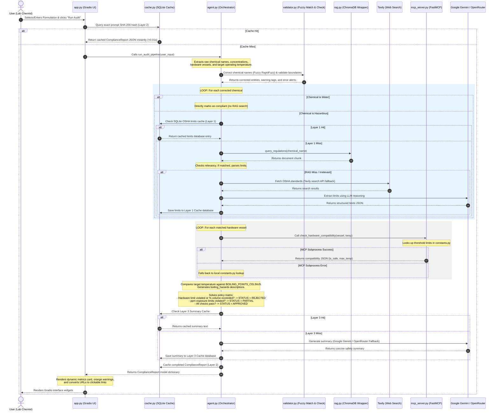

# System Architecture & Diagrams: Lab Safety Auditor

This document provides a comprehensive view of the system architecture, data transformations, and operational workflows of the upgraded **Automated Lab Safety Auditor** (EcoFormulate Audit Tool). 

All diagrams and descriptions are mapped directly to the actual code implementation in the repository.

---

## 1. System Components Overview

The system consists of the following files and structural layers:

* **Presentation Layer**: [app.py](file:///c:/L1_Project/app.py) (Gradio UI block layout, theme-aware CSS card injection, clickable link citations, event bindings).
* **Orchestration Layer**: [agent.py](file:///c:/L1_Project/agent.py) (Main pipeline, entity extractors, unit comparators, policy solver, Tavily search client fallback).
* **Validation Layer**: [validator.py](file:///c:/L1_Project/validator.py) (RapidFuzz string similarity corrections and physical boundary limit validators).
* **Caching Layer**: [cache.py](file:///c:/L1_Project/cache.py) (Multi-Tier SQLite database caching, including prompt SHA-256 caching and summary caching).
* **LLM Client Wrapper**: [llm_client.py](file:///c:/L1_Project/llm_client.py) (Unified async SDK wrapper for Google Gemini with dynamic OpenRouter free-tier fallback).
* **Storage / Vector Database**: [rag.py](file:///c:/L1_Project/rag.py) (ChromaDB persistent client, vector semantic queries) and [ingest.py](file:///c:/L1_Project/ingest.py) (ChromaDB collection setup and ingestion of raw regulatory text).
* **External Tooling Layer**: [mcp_server.py](file:///c:/L1_Project/mcp_server.py) (FastMCP server exposing hardware thermal boundaries via JSON).
* **Data Definition & Models**: [models.py](file:///c:/L1_Project/models.py) (Pydantic v2 schemas for type-safe validation) and [constants.py](file:///c:/L1_Project/constants.py) (Boiling points, hardware threshold definitions, configuration bounds).

---

## 2. Data Flow Diagram (DFD)

A Data Flow Diagram focuses on **data transformations, boundaries, processes, and storage**. It does not represent execution sequence or conditionals.

### Level 1 DFD (Data Processes and Stores)

---

## 3. Workflow Diagram (Sequence & Chronology)

The Workflow Diagram shows the **chronological sequence, conditional logic gates, loops, and async interactions** that occur during a single audit execution cycle.

---

## 4. Architectural Comparison: DFD vs. Workflow

To understand the system fully, observe how the **DFD** and **Workflow** represent different aspects of the same application:

| Feature / Aspect | Data Flow Diagram (DFD) | Workflow Diagram |
| :--- | :--- | :--- |
| **Primary Focus** | Data transformation, boundary separation, and database storage routing. | Execution chronology, call sequence, asynchronous subprocesses, and conditional logic. |
| **Logic & Decisions** | **Hidden.** Shows inputs feeding into processes; doesn't describe decision trees (like `APPROVED` vs. `REJECTED`). | **Explicit.** Shows conditional loops, fallback handlers, and branching parameters based on rules evaluation. |
| **Time Representation** | **None.** Data flows are concurrent and state-free; no sequence is implied. | **Linear/Sequential.** Represented with order numbers (1-32) and vertical timeline progression. |
| **Error / Fallback Paths** | Shows database and service nodes; does not show failure handlers (like falling back to `constants.py` when MCP fails). | Highlights the subprocess try-except block and manual database override fallback branches. |
