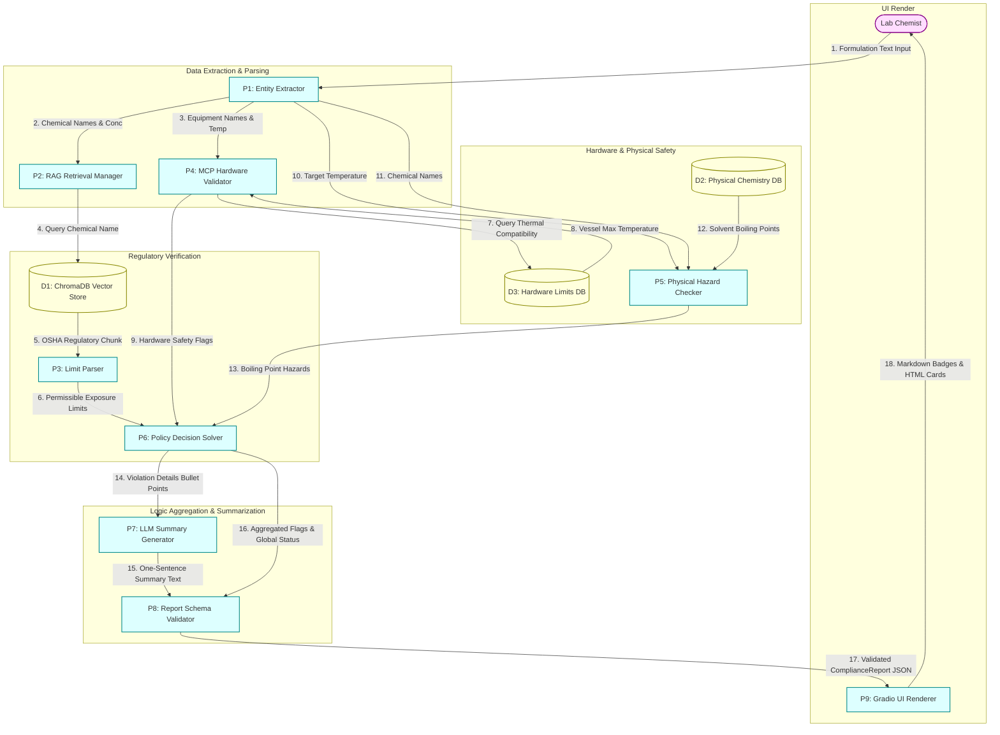
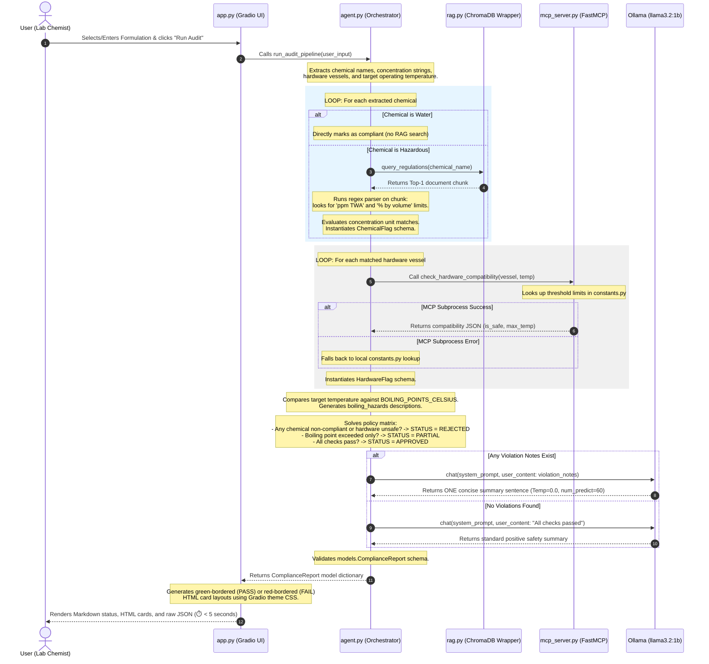

# System Architecture & Diagrams: Lab Safety Auditor

This document provides a comprehensive view of the system architecture, data transformations, and operational workflows of the **Automated Lab Safety Auditor** (EcoFormulate Audit Tool). 

All diagrams and descriptions are mapped directly to the actual code implementation in the repository.

---

## 1. System Components Overview

The system consists of the following files and structural layers:

* **Presentation Layer**: [app.py](file:///c:/L1_Project/app.py) (Gradio UI block layout, theme-aware CSS card injection, event bindings).
* **Orchestration Layer**: [agent.py](file:///c:/L1_Project/agent.py) (Main pipeline, entity extractors, unit comparators, policy solver, Ollama LLM integration).
* **Storage / Vector Database**: [rag.py](file:///c:/L1_Project/rag.py) (ChromaDB persistent client, vector semantic queries) and [ingest.py](file:///c:/L1_Project/ingest.py) (ChromaDB collection setup and ingestion of raw regulatory text).
* **External Tooling Layer**: [mcp_server.py](file:///c:/L1_Project/mcp_server.py) (FastMCP server exposing hardware thermal boundaries via JSON).
* **Data Definition & Models**: [models.py](file:///c:/L1_Project/models.py) (Pydantic v2 schemas for type-safe validation) and [constants.py](file:///c:/L1_Project/constants.py) (Boiling points, hardware threshold definitions, configuration bounds).

---

## 2. Data Flow Diagram (DFD)

A Data Flow Diagram focuses on **data transformations, boundaries, processes, and storage**. It does not represent execution sequence or conditionals.

### Level 1 DFD (Data Processes and Stores)

### DFD Process & Store Index

1. **Processes (P1 - P9)**:
   * **P1: Entity Extractor** (Regex-based in [agent.py:L20-L87](file:///c:/L1_Project/agent.py#L20-L87)): Parses text via four patterns to output list of chemical-concentration tuples and checks hardware keys.
   * **P2: RAG Retrieval Manager** (ChromaDB query in [rag.py:L8-L14](file:///c:/L1_Project/rag.py#L8-L14)): Calls ChromaDB query matching chemical names to get the `top-1` document.
   * **P3: Limit Parser** (Regex-based in [agent.py:L90-L112](file:///c:/L1_Project/agent.py#L90-L112)): Searches RAG document chunk for `ppm TWA` and `% by volume` limits.
   * **P4: MCP Hardware Validator** (Subprocess dispatch in [agent.py:L201-L223](file:///c:/L1_Project/agent.py#L201-L223)): Communicates with FastMCP via `stdio` transport. Fallback logic queries `constants.py` directly.
   * **P5: Physical Hazard Checker** (Boiling point safety in [agent.py:L182-L197](file:///c:/L1_Project/agent.py#L182-L197)): Checks if the operating temperature exceeds the physical boiling point of any extracted solvent.
   * **P6: Global Compliance Solver** (Logic solver in [agent.py:L254-L272](file:///c:/L1_Project/agent.py#L254-L272)): Evaluates compliance status of chemicals, safety bounds of equipment, physical limits, and sets status to `APPROVED`, `REJECTED`, or `PARTIAL`.
   * **P7: LLM Summary Generator** (Ollama in [agent.py:L280-L297](file:///c:/L1_Project/agent.py#L280-L297)): Calls `llama3.2:1b` (temperature=0.0, num_predict=60) with violation notes to generate a concise, fluent summary.
   * **P8: Report Schema Validator** (Pydantic in [agent.py:L299-L304](file:///c:/L1_Project/agent.py#L299-L304)): Packs details into the `ComplianceReport` model to enforce type schemas.
   * **P9: Gradio UI Renderer** (Presentation formatter in [app.py:L82-L163](file:///c:/L1_Project/app.py#L82-L163)): Turns JSON parameters into styled HTML/CSS component widgets.

2. **Data Stores (D1 - D3)**:
   * **D1: ChromaDB Vector Store**: A directory database (`./chroma_db`) storing embedded OSHA hazard documents loaded via [ingest.py](file:///c:/L1_Project/ingest.py).
   * **D2: Physical Chemistry DB**: A static table of chemical boiling points defined in [constants.py:L20-L28](file:///c:/L1_Project/constants.py#L20-L28).
   * **D3: Hardware Limits DB**: A static mapping of equipment thermal limits in [constants.py:L13-L18](file:///c:/L1_Project/constants.py#L13-L18).

---

## 3. Workflow Diagram (Sequence & Chronology)

The Workflow Diagram shows the **chronological sequence, conditional logic gates, loops, and async interactions** that occur during a single audit execution cycle.

---

## 4. Architectural Comparison: DFD vs. Workflow

To understand the system fully, observe how the **DFD** and **Workflow** represent different aspects of the same application:

| Feature / Aspect | Data Flow Diagram (DFD) | Workflow Diagram |
| :--- | :--- | :--- |
| **Primary Focus** | Data transformation, boundary separation, and database storage routing. | Execution chronology, call sequence, asynchronous subprocesses, and conditional logic. |
| **Logic & Decisions** | **Hidden.** Shows inputs feeding into processes; doesn't describe decision trees (like `APPROVED` vs. `REJECTED`). | **Explicit.** Shows conditional loops, fallback handlers, and branching parameters based on rules evaluation. |
| **Time Representation** | **None.** Data flows are concurrent and state-free; no sequence is implied. | **Linear/Sequential.** Represented with order numbers (1-32) and vertical timeline progression. |
| **Error / Fallback Paths** | Shows database and service nodes; does not show failure handlers (like falling back to `constants.py` when MCP fails). | Highlights the subprocess try-except block and manual database override fallback branches. |
